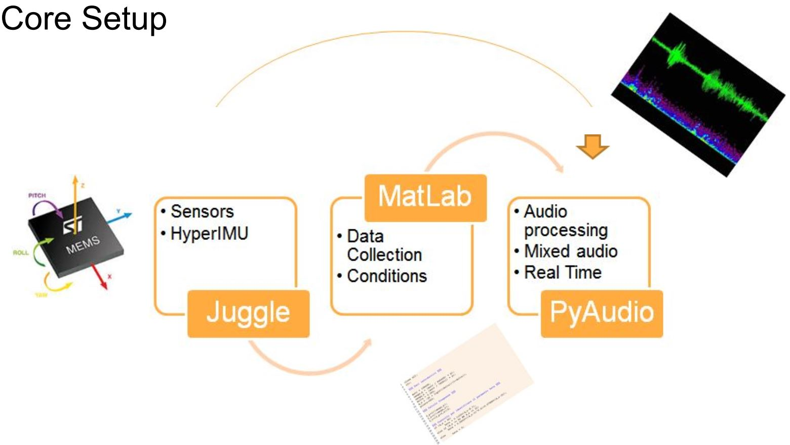

# Transform-Motion-into-Sound-Effects
By using IMU sensors we collect the movements of a juggling club in real time and interpret them as sound effect signals to an on-playing song.

## Things you will learn
* Pyaudio sound effect processing
* Create a keyboard interface through Pygame
* Reading IMU data via UDP in Python
* Reading IMU data via UDP into Matlab for Real-Time plotting (for exactring features from motion patterns)

## Overview
The overall structure of the Python code involves collecting data coming from the sensors by the HyperIMU android app via UDP, determining which conditions (pre-determine motions) the data satisfies as it is being processed in real time, and based on the threshold condition (motion), passing the condition to a specific function for a different audio effect. More than two sound effects can also be triggered via a keyboard.

**Preconditions**
Before determining the motion conditions directly into python we studied the data by plotting it in Matlab in real time. Once the features needed were extracted we procedded directly into python as you can see in the image above with the long curve from juggling to audio effects. Although real time plotting could be done in Python, we decided to use Matlab because we simply had the code already from another project.

* Function for amplitude modulation is called func_duck() 
* Function for the vibrato effect is called func_vibrato.
* Function for the robotization effect is called func_robotization.
* Function for echo is called func_echo.
* Function for the reverberation effect is called func_reverberation.

This project has two independent input methods: the incoming data from sensors & keyboard inputs. Both can trigger sound effects on the on-playing music. We creted a keyboard input interaction to mainly test our audio effects. 

We have included 
* DEMO files for the keyboard interface through Pygame,
* DEMO files for reading IMU data via UDP and real time plotting in Matlab.
* DEMO files for reading IMU data via UDP in Python

## Pattern recognition
Using an android application called HyperIMU (Inertial Measurement Unit), we managed to gain access to Micro-Electro-Mechanical System (MEMS) sensors straight from our cell phones. HyperIMU allowed us to select the different sensors that exist in smartphones and collect the motion data. The physical sensors used were the accelerometer, gyro, and magnetometer. Through these sensors we implement sensor fusion to take advantage of virtual sensors, such as the linear accelerometer, gravity, rotation vector and compass. Another great feature of the application was the network protocols that were available. We used User Datagram Protocol (UDP) to transmit the sensor data in real time from the phone to a computer, and then read it in Matlab for pattern recognition. (Same technique is later used directly into Python but instead of graphing for pattern recognition we play the audio effect directly). The motion data was transmitted every 20ms as a CSV file. We then plotted all the 3 axis data of each sensor in real-time. Figure 1 shows a real time plot of the data collected from the rotational vector only.

Afterwards, we observed all twelve plots and constructed five different conditions based on the behavior of the plots. Each condition was used to implement a different audio effect. The five audio effects we decided to implement were amplitude modulation, vibrato, robotization, reverberation and echo, which were all implemented (in real time) on a wave file. Our wave file was Charlie Puth’s hit song, “We Don’t Talk Anymore,” featuring Selena Gomez. We asked Selena Gomez for permission and she said it was okay to use her song (yeah right!). 

 We decided that the amplitude modulation would be a result of the faceup toss, as shown in Figure 2, and the robotization effect would take place when the juggling pins were upright, as shown in Figure 3. The reverberation effect would take place when a circular motion occurred, as shown in Figure 4, and the echo effect would take place whenever the jugglers performed a weave with the pin, as shown in Figure 5. We went with these specific motions because these are the most common types of movements in juggling.
 
 
 
 ## Motion into Pyaudio
  In our Python code, we decided that the amplitude modulation (duck sound) would take place whenever the Z-Gravity Sensor was greater than 7 and the robotization effect would take place whenever the Y-Gravity Sensor was greater than 7. The vibrato would take place whenever the Z-Gyroscope was above .5 and the reverberation effect (feedback) would take place whenever √(X − Linear acceleration)2 + (Z − Linear Acceleration)2 was greater than 3. The echo effect would take place whenever |X − Rotational V ector| + |Z − rotational vector| was greater than 2 

These thresholds and audio effects were implemented in Python using if statements to correspond with a different audio processing effect. In order to implement multiple conditions at once, we placed flags in the Python code (the variable is called noCondition). Figure 6 shows a fragment of the Python code with two of the conditions and audio effects (echo and reverberation). Gff refers to the feed forward gain, Gdp refers to the direct path gain and Gfb refers to the feedback gain. These are just parameters that are needed to implement echo and reverberation in Python. 

## Keyboard for testing
We also implemented PyGame to incorporate keyboard control, providing users with two methods of input (real time motion or pressing a button on the keyboard). We initially came up with this method because we just wanted to make sure that the audio effect was programmed correctly, regardless of the juggling motion. This is why the “condition3True” and “condition4True” variables are in the if statements. For amplitude modulation (condition1True), 4we press the “a” key. For the vibrato effect (condition2True), we press the “v” key. For the echo effect (condition3True), we press the “e” key. For the reverberation effect (condition4True), we press the “f” key. For the robotization effect (condition5True), we press the “r” key. These keyboard inputs can be considered another set of threshold conditions, as an alternative to juggling motion. Figure 7 shows the Pygame implementation for keyboard control

 

## Future Improvements
* Considering switching to bluetooth (we tried to do this earlier on for this project, but decided to switch to Wi-Fi due to time constraints)
* Utilizing swarm robotics for collective behavior of the system: juggling patterns.
* Researching more juggling patterns and juggling theory for a better understanding of the different motions that take place in juggling.
